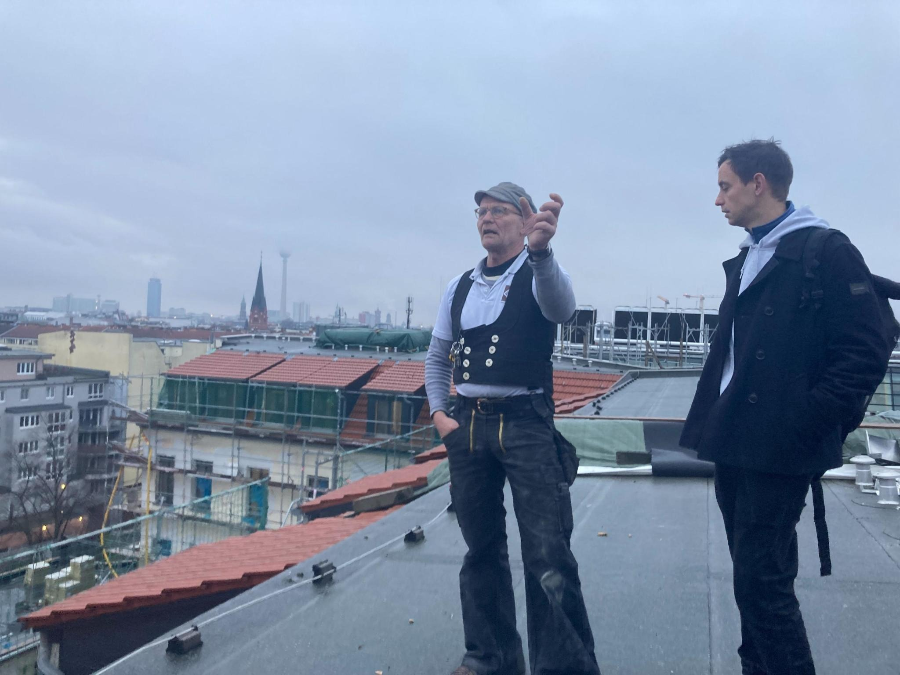

## Ihr Ansprechpartner ##
Niklas Mahren

Gründächer sind nicht nur gut für das Stadtklima, sondern auch gut für die Bausubstanz und den sommerlichen Wärmeschutz von Gebäuden. Die geringen Temperaturschwankungen in der Dachabdichtung wirken sich positiv auf die Beständigkeit aus und es können langfristig Instandhaltungs- und Reparaturkosten gespart werden. 
Speziell extensive Gründächer sind durch die geringen Wartungsansprüche ideal für eine Vielzahl von Dachflächen geeignet.
Für eine fachgerechte Umsetzung beraten wir Sie gerne hinsichtlich der Lastreserven des Daches und den Aufbau des Gründachs (extensive Begrünung / intensive Begrünung). Neben der Planung und Umsetzung übernehmen wir auch die Aufzuchtpflege der Begrünung, um ein gesundes Anwachsen der Pflanzen zu sichern.



"Extensive Begrünung" im Bereich der Flachdächer bezieht sich auf eine Art der Dachbegrünung, die darauf ausgelegt ist, pflegeleicht und umweltfreundlich zu sein. Diese Begrünungsform wird oft für Flachdächer verwendet und hat mehrere charakteristische Merkmale:

- **Geringe Substrattiefe**: Im Vergleich zur intensiven Dachbegrünung, die tiefere Substratschichten für größere Pflanzen benötigt, hat die extensive Begrünung eine relativ dünne Substratschicht, oft nur wenige Zentimeter dick.

- **Niedrige Wartungsanforderungen**: Extensive Dachgärten sind so konzipiert, dass sie minimale Pflege benötigen. Sie werden oft mit Pflanzenarten bepflanzt, die widerstandsfähig gegen extreme Wetterbedingungen sind und wenig Wasser und Pflege benötigen.

- **Leichte Konstruktion**: Aufgrund der geringeren Substrattiefe und der Verwendung von Leichtgewichtspflanzen ist die extensive Dachbegrünung in der Regel leichter als intensive Dachgärten. Dies macht sie geeignet für Dächer, die keine schwere Last tragen können.

- **Umweltvorteile**: Extensive Dachbegrünungen bieten verschiedene ökologische Vorteile, wie die Verbesserung der Luftqualität, die Reduzierung des urbanen Wärmeinseleffekts, die Erhöhung der biologischen Vielfalt und die Verbesserung der Wasserrückhaltung.

- **Pflanzenauswahl**: Typische Pflanzen für extensive Dachbegrünungen sind Sedum-Arten, Moos, Kräuter und andere niedrigwachsende, trockenresistente Pflanzen.

Extensive Dachbegrünungen sind eine kosteneffiziente und umweltfreundliche Lösung, um unbebaute Flachdachflächen zu nutzen und gleichzeitig zur Verbesserung des städtischen Mikroklimas beizutragen.



"Intensive Begrünung" im Bereich der Flachdächer bezeichnet eine Form der Dachbegrünung, die umfangreicher und pflegeintensiver ist als die extensive Begrünung. Diese Art der Dachbegrünung wird oft mit einem herkömmlichen Garten oder Park verglichen und weist folgende charakteristische Merkmale auf:

- **Tiefere Substratschichten**: Intensive Dachgärten erfordern eine deutlich dickere Substratschicht, oft zwischen 15 cm und mehreren Metern. Diese Tiefe ist notwendig, um eine größere Vielfalt an Pflanzen, einschließlich Sträuchern und Bäumen, zu unterstützen.

- **Höhere Wartungsanforderungen**: Im Gegensatz zur extensiven Begrünung benötigen intensive Dachgärten regelmäßige Pflege, ähnlich wie traditionelle Gärten. Dazu gehören Bewässerung, Düngung, Unkrautentfernung und Schnittarbeiten.

- **Schwerere Konstruktion**: Aufgrund der größeren Substrattiefe und der schwereren Pflanzen ist eine intensive Dachbegrünung deutlich schwerer. Dies erfordert eine stärkere Dachkonstruktion, um das zusätzliche Gewicht zu tragen.

- **Vielfältige Nutzungsmöglichkeiten**: Intensive Dachgärten können vielseitig genutzt werden, beispielsweise als Erholungsflächen, Gärten für den Anbau von Nahrungsmitteln oder als dekorative Landschaftsgärten.

- **Pflanzenauswahl**: Die Pflanzenauswahl bei intensiven Dachgärten ist viel breiter und kann Sträucher, kleine Bäume, Blumenbeete und Rasenflächen umfassen.

- **Umweltvorteile**: Obwohl intensive Dachgärten mehr Pflege benötigen, bieten sie ähnliche ökologische Vorteile wie extensive Begrünungen, einschließlich Verbesserung der Luftqualität, Reduzierung des urbanen Wärmeinseleffekts und Schaffung von Lebensräumen für Wildtiere.

Intensive Dachbegrünungen sind ideal für Projekte, bei denen ein nutzbarer Grünraum auf dem Dach gewünscht wird, z. B. für Erholungsflächen in Bürogebäuden oder Wohnanlagen. Sie erfordern jedoch eine sorgfältige Planung und regelmäßige Wartung.

